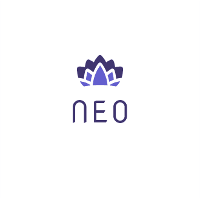

# 💜 NEO(Need Each Other)

<figure><figcaption>
NEO : Need Each Other
</figcaption></figure>

## 🏄🏻‍♂️ NEO FlowCharts

전체적인 Application의 흐름을, UI와 간단한 비즈니스 로직으로 표현했습니다.



## 💾 NEO UML

데이터베이스 UML



## 🗂 NEO API Docs

gitbook을 활용해 작성한 API Docs입니다. 추후에 Swagger를 사용해 Testable한 API Docs를 생성할 예정입니다.


[neo-api-reference](reference/neo-api-reference/)


